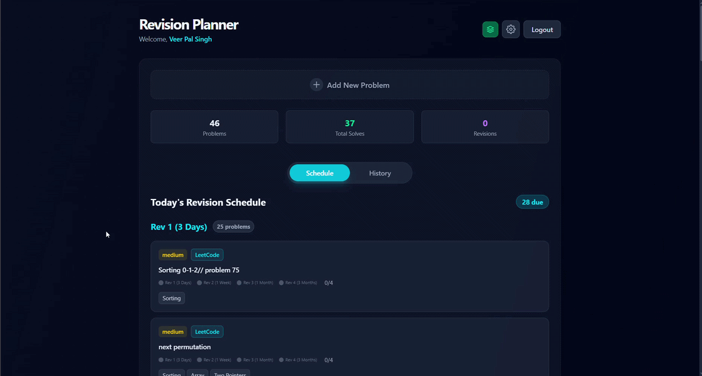

<div align="center">
  
  <h1>Revision Mania</h1>
  <p><i>Smart Revision for Continuous Learning</i></p>
</div>

  # 🚀 Revision Mania

  **Master your problem-solving skills with smart, spaced-repetition tracking.**

  [](https://react.dev/)
  [](https://vitejs.dev/)
  [](https://firebase.google.com/)
  [](https://tailwindcss.com/)
  [](https://www.framer.com/motion/)

  [Live Demo](https://your-live-link.com) · [Report Bug](https://github.com/veerpalsingh/revision_mania/issues) · [Request Feature](https://github.com/veerpalsingh/revision_mania/issues)
</div>

---

## 📖 About The Project

**Revision Mania** is a modern, responsive web application designed for students, developers, and competitive programmers to keep track of the problems they've solved and schedule smart revisions. 

Instead of forgetting the logic to a tough Data Structures & Algorithms (DSA) problem a week after solving it, Revision Mania uses interval-based reminders to ensure you revisit and truly master your problem-solving techniques.

### ✨ Key Features

* 🔐 **Secure Authentication:** Seamless Email/Password and social login powered by Firebase.
* 🧠 **Smart Revision Tracking:** Custom or sequential interval-based tracking to remind you when a problem needs revisiting.
* 📊 **Dashboard & Statistics:** Get a bird's-eye view of your progress, total solves, and pending revisions.
* ⚡ **Real-Time Sync:** Data updates instantly across all your devices using Firestore real-time listeners.
* 🎭 **Smooth Animations:** Buttery smooth UI transitions and modal popups using Framer Motion.
* 📱 **PWA Ready:** Installable on your mobile or desktop device for offline-like quick access.

---

## 📸 Sneak Peek

<div align="center">
  
</div>

---

## 🛠️ Tech Stack

| Category | Technologies |
| :--- | :--- |
| **Frontend** | React 19, Vite |
| **Styling** | Tailwind CSS v4 |
| **Animations** | Framer Motion |
| **Backend / BaaS** | Firebase (Auth, Firestore, Storage) |
| **Tooling** | ESLint, Vite PWA Plugin |

---

## 🚀 Getting Started

To get a local copy up and running, follow these simple steps.

### Prerequisites

Make sure you have Node.js and npm installed on your machine.
* npm
    ```sh
    npm install npm@latest -g
    ```

### Installation

1. **Clone the repo**
   ```sh
   git clone https://github.com/veerpalsingh/revision_mania.git
   ```

2. **Navigate to the directory**
    ```sh
   cd revision_mania
   ```

3. **Install NPM packages**
    ```sh
    npm install
    ```

4. **Set up Firebase Environment Variables**
   Create a `.env` file in the root directory and add your Firebase config keys:
    ```env
    VITE_FIREBASE_API_KEY=your_api_key
    VITE_FIREBASE_AUTH_DOMAIN=your_auth_domain
    VITE_FIREBASE_PROJECT_ID=your_project_id
    VITE_FIREBASE_STORAGE_BUCKET=your_storage_bucket
    VITE_FIREBASE_MESSAGING_SENDER_ID=your_messaging_sender_id
    VITE_FIREBASE_APP_ID=your_app_id
    VITE_FIREBASE_MEASUREMENT_ID=your_measurement_id
    ```

5. **Run the development server**
    ```sh
    npm run dev
    ```

---

## 📂 Folder Structure

<details>
<summary>Click to expand folder structure</summary>

```text
revision_mania/
├── public/                 # Static assets (Favicons, Images)
├── src/
│   ├── components/         # Reusable UI components (Auth, Loader, Toast, etc.)
│   ├── hooks/              # Custom React hooks (useAuth, useProblems, useSettings)
│   ├── Revision/           # Core domain components (Dashboard, Forms, Tables)
│   ├── App.jsx             # Main Application Shell & Routing
│   ├── firebase.js         # Firebase initialization
│   ├── index.css           # Global Tailwind styles
│   └── main.jsx            # React Entry Point
├── .env                    # Environment variables (Ignored in Git)
├── eslint.config.js        # Linter rules
├── package.json            # Dependencies & Scripts
└── vite.config.js          # Vite configuration
```

</details>

---

## 🤝 Contributing

Contributions are what make the open-source community such an amazing place to learn, inspire, and create. Any contributions you make are **greatly appreciated**.

1. Fork the Project
2. Create your Feature Branch (`git checkout -b feature/AmazingFeature`)
3. Commit your Changes (`git commit -m 'Add some AmazingFeature'`)
4. Push to the Branch (`git push origin feature/AmazingFeature`)
5. Open a Pull Request

---

## 📜 License

This project is licensed under the MIT License. See the [LICENSE](LICENSE) file for details.

---

<div align="center">
<p>Built with ❤️ by <b>Veer Pal Singh</b></p>
<p>
<a href="https://github.com/veerpalsingh">GitHub</a> •
<a href="https://www.linkedin.com/in/veerpalsingh">LinkedIn</a>
</p>
</div>
